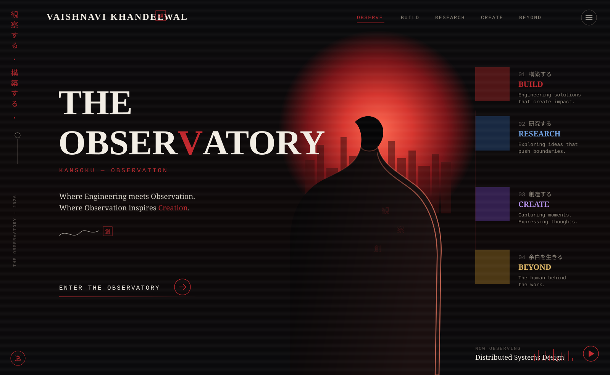

<div align="center">

</div>

<br/>

<div align="center">

<sub>観察する・構築する・研究する・創造する</sub>
<br/>
<sub><i>where engineering meets observation, and observation inspires creation.</i></sub>

</div>

<br/>

---

<br/>

## 01 &nbsp;&nbsp;構築する &nbsp;—&nbsp; BUILD

<sub>Engineering solutions that create impact.</sub>

<table>
<tr>
<td width="50%" valign="top">

**Student Connect Hub**
Cyberpunk interactive platform with real-time collaboration
`MERN` · `WebSockets` · Active

</td>
<td width="50%" valign="top">

**WhatsApp Auto-Commerce**
Plug-and-play ordering system for small businesses
`Node.js` · `WhatsApp API` · Beta

</td>
</tr>
<tr>
<td width="50%" valign="top">

**P2P Mesh Network**
Emergency communication without internet
`WebRTC` · `Distributed Hash Tables` · Prototype

</td>
<td width="50%" valign="top">

**IoT Home Automation**
Wireless sensor network with remote monitoring
`Arduino` · `MQTT` · `React` · Active

</td>
</tr>
</table>

<br/>

---

<br/>

## 02 &nbsp;&nbsp;研究する &nbsp;—&nbsp; RESEARCH

<sub>Exploring ideas that push boundaries.</sub>

**Core Languages**


**Frontend**


**Backend & Data**


**Infrastructure**


<sub>currently studying: system design at scale · event-driven architecture</sub>

<br/>

---

<br/>

## 03 &nbsp;&nbsp;創造する &nbsp;—&nbsp; CREATE

<sub>Capturing moments. Expressing thoughts, in code.</sub>

<div align="center">


<br/><br/>


<br/><br/>

<picture>
  <source media="(prefers-color-scheme: dark)" srcset="https://raw.githubusercontent.com/anditisyou/anditisyou/output/github-contribution-grid-snake-dark.svg" />
  
</picture>

</div>

<br/>

---

<br/>

## 04 &nbsp;&nbsp;余白を生きる &nbsp;—&nbsp; BEYOND

<sub>The human behind the work.</sub>

```
mindset        : scale-first development
philosophy     : build systems that survive traffic spikes, not just demos
principles     : modularity over monoliths · caching before optimization
                 async by default · fail gracefully · log everything
fun fact       : debugs faster with lo-fi beats and neon lighting
```

<br/>

<div align="center">

[](https://www.linkedin.com/in/vaishnavi-khandelwal-777121289/)
&nbsp;
[](https://www.instagram.com/yo_extra/)
&nbsp;
[](https://vaishnavikhandelwal.netlify.app/)
&nbsp;
[](mailto:vaishnavikhandelwal1781@gmail.com)

<br/><br/>

<i>"Where engineering meets observation. Where observation inspires creation."</i>

<br/>


</div>

<br/>


