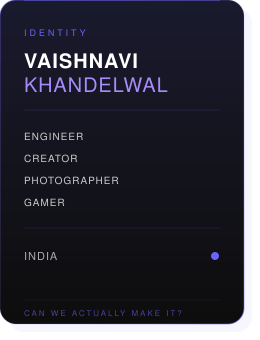

<!-- ═══════════════════════════════════════════════════════════════════════════
     VAISHNAVI KHANDELWAL — GitHub Profile README
     Professional · Creative · Interactive
     ═══════════════════════════════════════════════════════════════════════════ -->

<!-- ─────────────────────────── HERO ─────────────────────────── -->

 
 

&nbsp;
&nbsp;
&nbsp;
&nbsp;
&nbsp;

 
 

---

<!-- ─────────────────────────── 01 ABOUT ─────────────────────────── -->

## 01 — ABOUT

<table>
<tr>
<td width="60%" valign="top">

I'm an engineering student from India who works where **technology meets creativity**.

I build software and interactive experiences, photograph moments, explore art and fashion, and spend some of my free time gaming, playing chess or basketball.

I don't really fit into one box — and I'm okay with that.

 

`ENGINEER` · `CREATOR` · `PHOTOGRAPHER` · `GAMER`

</td>
<td width="40%" valign="top" align="center">

</td>
</tr>
</table>

---

<!-- ─────────────────────────── 02 WHAT I BUILD ─────────────────────────── -->

## 02 — WHAT I BUILD

<table>
<tr>
<td width="33%" valign="top">

**Software Engineering**

Building systems that solve real problems — from backend logic to full-stack applications.

</td>
<td width="33%" valign="top">

**Web & Interactive**

Websites and experiences that respond, move, and feel intentional.

</td>
<td width="33%" valign="top">

**System Design & UI/UX**

Architecture that scales. Interfaces that make sense. Both matter.

</td>
</tr>
</table>

 

**STACK**

 
 

---

<!-- ─────────────────────────── 03 SELECTED WORK ─────────────────────────── -->

## 03 — SELECTED WORK

<!-- ═══════════════════════════════════════════════════════════════════════
     PROJECT CARDS — Replace placeholders with your actual project data.
     Each card is a self-contained HTML table designed for GitHub.
     ═══════════════════════════════════════════════════════════════════════ -->

<table>
<tr>
<td width="50%" valign="top">

<table>
<tr>
<td>

### PROJECT NAME

> One-line description of what it does.

`Tech` · `Tech` · `Tech`

**Status:** `In Progress`

[GitHub](#) · [Live Demo](#)

</td>
</tr>
</table>

</td>
<td width="50%" valign="top">

<table>
<tr>
<td>

### PROJECT NAME

> One-line description of what it does.

`Tech` · `Tech` · `Tech`

**Status:** `In Progress`

[GitHub](#) · [Live Demo](#)

</td>
</tr>
</table>

</td>
</tr>
<tr>
<td width="50%" valign="top">

<table>
<tr>
<td>

### PROJECT NAME

> One-line description of what it does.

`Tech` · `Tech` · `Tech`

**Status:** `In Progress`

[GitHub](#) · [Live Demo](#)

</td>
</tr>
</table>

</td>
<td width="50%" valign="top">

<table>
<tr>
<td>

### PROJECT NAME

> One-line description of what it does.

`Tech` · `Tech` · `Tech`

**Status:** `In Progress`

[GitHub](#) · [Live Demo](#)

</td>
</tr>
</table>

</td>
</tr>
</table>

→ Replace each card with your actual repositories. Keep only your 3–4 strongest projects.

---

<!-- ─────────────────────────── 04 CREATIVE SIDE ─────────────────────────── -->

## 04 — CREATIVE SIDE

<table>
<tr>
<td width="50%" valign="top">

Outside engineering, I'm drawn to **photography**, **art**, **fashion**, **gaming**, **chess**, and **basketball**.

Photography is the most personal of these. I like it because it lets me keep moments that would otherwise disappear — places, people, small details, moods.

</td>
<td width="50%" valign="top">

<!-- PHOTOGRAPHY STRIP — Replace with actual images when available -->
<!-- Example:

-->

`[ Photography gallery — add images to assets/ ]`

</td>
</tr>
</table>

---

<!-- ─────────────────────────── 05 GITHUB ACTIVITY ─────────────────────────── -->

## 05 — ACTIVITY

 

 
 

---

<!-- ─────────────────────────── 06 CURRENTLY EXPLORING ─────────────────────────── -->

## 06 — CURRENTLY EXPLORING

 

 
 

`SYSTEM DESIGN` · `CREATIVE CODE` · `INTERACTIVE WEB` · `PHOTOGRAPHY` · `3D WEB` · `UI/UX`

---

<!-- ─────────────────────────── 07 CONNECT ─────────────────────────── -->

## 07 — CONNECT

 

*Building things, collecting moments, figuring out what's next.*

 
 

&nbsp;
&nbsp;
&nbsp;

 
 

